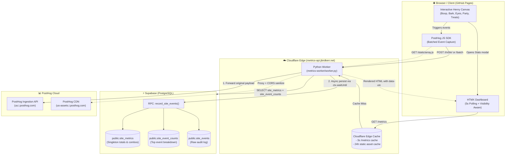
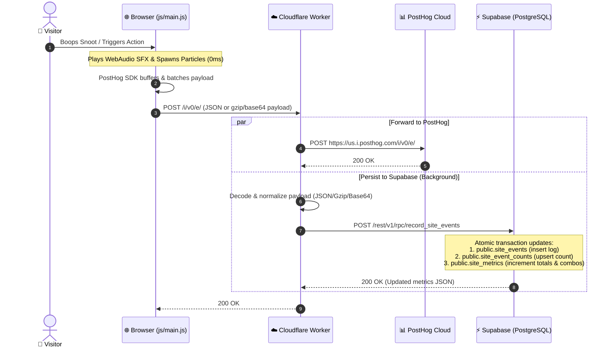
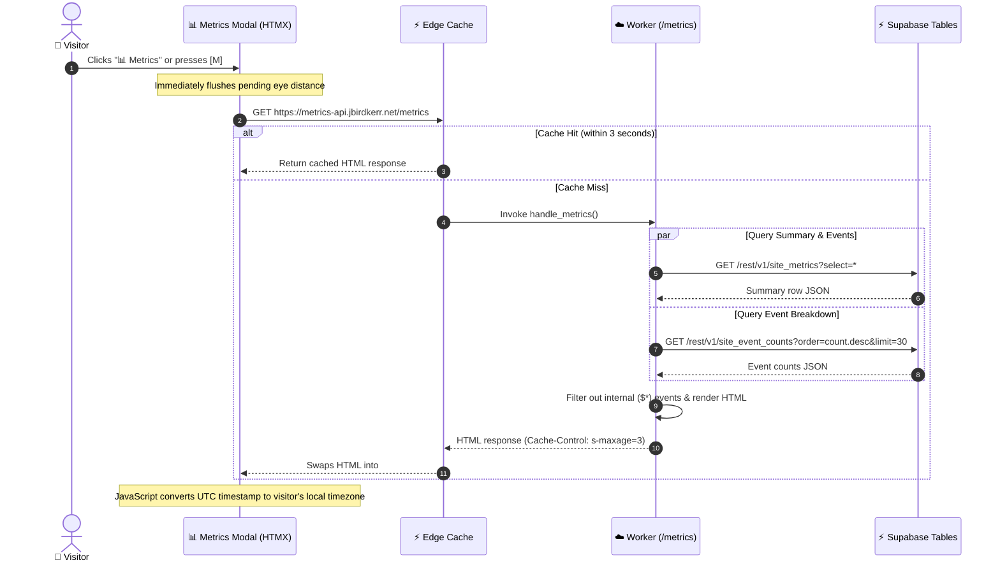

# jbirdkerr.net & Metrics Infrastructure

Personal interactive website hosted on **GitHub Pages** with a real-time event analytics and persistence pipeline powered by **Cloudflare Workers (Python)**, **Supabase (PostgreSQL)**, and **PostHog**.

---

## 🏗️ System Architecture



---

## 🔄 Metrics Flow & Sequence

### 1. Event Capture & Dual Ingestion Pipeline

When a user interacts with the canvas (boops the snoot, rolls the eyes, engages party mode, or showers treats), events are captured and written to both PostHog and Supabase in parallel:



### 2. Live Dashboard Rendering Flow

When the metrics modal is opened, HTMX queries the Cloudflare Worker which retrieves the latest metrics from Supabase:



---

## 📁 Repository Structure

```
.
├── index.html                   # Clean, semantic HTML skeleton
├── css/
│   └── style.css                # All layout, animations, modals & retro styles
├── js/
│   └── main.js                  # Audio synthesis, particle engine, tracking & UI logic
├── img/
│   ├── henrybeard.png           # Main interactive dog photo
│   └── henrybeard.jpg           # High-res photo source
├── metrics-worker/
│   ├── worker.py                # Cloudflare Python Worker (PostHog proxy + Supabase metrics)
│   ├── pyproject.toml           # Python worker runtime configuration
│   └── wrangler.toml            # Cloudflare Worker deployment settings
└── supabase/
    ├── migrations/              # PostgreSQL schema & RPC function migrations
    └── config.toml              # Supabase local & remote configuration
```

---

## 🛰️ Worker API Endpoints

| Method | Endpoint | Description | Caching Strategy |
| :--- | :--- | :--- | :--- |
| `GET` | `/metrics` | Fetches aggregated statistics from Supabase and returns styled HTML for HTMX. | `public, max-age=2, s-maxage=3` (Cloudflare edge cached) |
| `POST` | `/i/v0/e/`, `/batch` | Proxies analytics captures to PostHog and persists events to Supabase via RPC. | `no-store` |
| `GET` | `/static/*`, `/array/*` | Proxies PostHog JavaScript SDK static scripts to avoid ad-blocker issues. | `public, max-age=86400` (24h cache, CORS: `*`) |
| `GET` | `/health` | Service health check returning UTC ISO timestamp. | `no-store` |
| `OPTIONS` | `*` | Dynamic CORS preflight handler reflecting allowed origins and headers. | Handled via preflight headers |

---

## 🔐 Environment Variables & Secrets

### Cloudflare Worker Configuration (`wrangler.toml`)

* `POSTHOG_PROJECT_ID`: PostHog Project ID.
* `SUPABASE_URL`: Target Supabase project REST URL (`https://<project-ref>.supabase.co`).

### Cloudflare Worker Secrets (CLI Upload)

Store the private database access token securely in Cloudflare:

```bash
# Production Supabase Service Role Key (used for backend RPC and queries)
npx wrangler secret put SUPABASE_SERVICE_ROLE_KEY --env production
```

---

## 🚀 Deployment

### 1. Static Website (GitHub Pages)
Pushes to the `main` branch automatically build and publish static assets (`index.html`, `css/`, `js/`, `img/`) to GitHub Pages via GitHub Actions (`.github/workflows/static.yml`).

### 2. Cloudflare Worker Deployment
Deploy the Python worker to Cloudflare Workers with custom domain routing:

```bash
npx wrangler deploy --env production
```

### 3. Supabase Database Setup
Run the migration script in [`supabase/migrations/20260923042823_01-initial-schema.sql`](supabase/migrations/20260923042823_01-initial-schema.sql) in your Supabase SQL Editor to establish:
1. `site_metrics`: Singleton summary counters.
2. `site_event_counts`: Aggregated event breakdown table.
3. `site_events`: Full historical event log.
4. `record_site_events(p_events)`: Atomic batch ingestion stored procedure.
