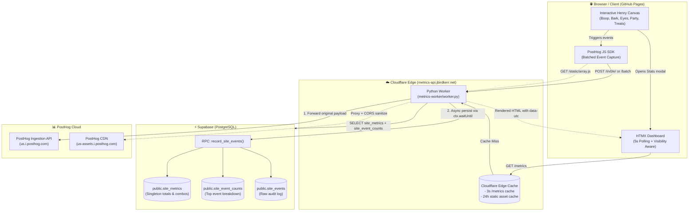

# 🏗️ System Architecture

This document provides a comprehensive view of the **jbirdkerr.net** multi-tier system architecture.

---

## Architecture Diagram

---

## Component Breakdown

### 1. Client Tier (Browser / GitHub Pages)
- **Static Hosting**: Served via GitHub Pages on custom domain `jbirdkerr.net`.
- **Interactive Engine (`js/main.js`)**:
  - WebAudio synthesis for SFX (bark, boop, treat crunch).
  - Canvas particle dynamics and eye tracking.
  - Keyboard shortcuts (`B` for boop, `T` for treats, `P` for party, `M` for metrics modal).
- **Telemetry (`PostHog JS SDK`)**: Buffers and batches user interactions, sending them through the edge worker reverse proxy to avoid ad blockers.
- **Dynamic UI (`HTMX`)**: Handles live modal hydration from edge worker HTML endpoints with automatic visibility awareness and 5-second polling.

### 2. Edge Compute Tier (Cloudflare Workers)
- **Runtime**: Cloudflare Workers running Python (`metrics-worker/worker.py`).
- **Domain**: `metrics-api.jbirdkerr.net`.
- **Key Responsibilities**:
  - **Reverse Proxy**: Intercepts PostHog script loading and event ingestion, stripping tracking blocker flags and sanitizing CORS headers.
  - **Dual-Write Orchestrator**: Forwards events to PostHog Cloud while concurrently kicking off async database writes via `ctx.waitUntil`.
  - **Edge Rendering**: Formats database metrics into clean, server-rendered HTML chunks for HTMX consumption.
  - **Edge Caching**: Enforces a 3-second cache on `/metrics` and 24-hour cache on proxied PostHog assets.

### 3. Persistence Tier (Supabase / PostgreSQL)
- **Singleton Aggregates (`site_metrics`)**: Real-time rollups for boops, barks, treats, eye distance traveled, and party combos.
- **Top Breakdown (`site_event_counts`)**: Upsert-tracked counters per event type for fast breakdown rendering.
- **Audit Log (`site_events`)**: Append-only log of raw interaction payloads.
- **Atomic Stored Procedure (`record_site_events`)**: Executes batch processing within a single database transaction to guarantee consistency and minimize connection round-trips.

### 4. Analytics Tier (PostHog Cloud)
- Ingests raw session event data for long-term analytics, user session exploration, and retention analysis without bogging down operational transactional databases.

---

## Related Documentation

- [Metrics & Sequence Flows](metrics-pipeline.md)
- [Worker API Reference](api.md)
- [Database Schema](../supabase/migrations/20260923042823_01-initial-schema.sql)
