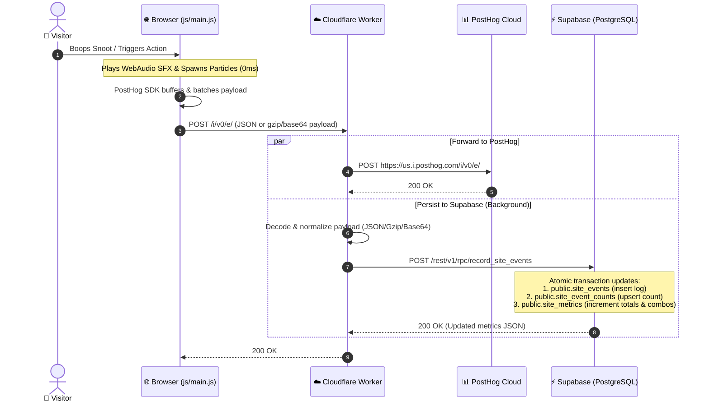
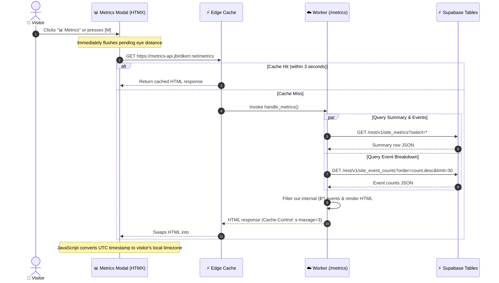

# 🔄 Metrics Pipeline & Sequence Flows

This document details the sequence flows for event capture, parallel persistence, and live dashboard rendering in **jbirdkerr.net**.

---

## 1. Event Capture & Dual Ingestion Pipeline

When a user interacts with the canvas (boops the snoot, rolls the eyes, engages party mode, or showers treats), events are captured and written to both PostHog and Supabase in parallel.

### Detailed Pipeline Stages

1. **Immediate Feedback (0ms Latency)**: Audio synthesis and particle effects trigger instantly on the client thread without waiting on network I/O.
2. **Batching & Compression**: PostHog's JS SDK buffers interactions and sends them via `POST /i/v0/e/` or `/batch`, encoded as raw JSON or gzipped base64 strings.
3. **Edge Forking**:
   - The Cloudflare Python Worker immediately proxies the untouched payload to PostHog Ingestion (`us.i.posthog.com`).
   - Concurrently, inside an async background task (`ctx.waitUntil`), the worker decodes the payload, extracts custom metrics (e.g. boops, eye roll distance in px, treat counts), and dispatches them to Supabase.
4. **Atomic Transaction in Supabase**:
   - `record_site_events(p_events)` runs as a single PostgreSQL transaction.
   - Inserts raw events into `public.site_events`.
   - Upserts aggregated totals into `public.site_event_counts`.
   - Updates global counters in `public.site_metrics`.

---

## 2. Live Dashboard Rendering Flow

When the metrics modal is opened, HTMX queries the Cloudflare Worker which retrieves the latest metrics from Supabase:

### Key Performance & Caching Features

- **Pending Queue Flush**: Clicking "📊 Metrics" triggers a flush of any in-flight eye movement distance before querying the stats, ensuring immediate accuracy.
- **Edge Cache TTL**: Cached for 3 seconds (`s-maxage=3`) on Cloudflare's edge network, shielding the database from heavy concurrent polling while keeping stats virtually real-time.
- **Server-Side HTML Rendering**: The worker compiles the HTML directly using semantic Tailwind/retro-styled markup and emits UTC ISO timestamps (`data-utc`).
- **Client-Side Local Timezone Translation**: A tiny inline script parses `data-utc` elements to display "Last updated" timestamps in the visitor's local time format.

---

## Related Documentation

- [System Architecture](architecture.md)
- [Worker API Reference](api.md)
- [Database Schema](../supabase/migrations/20260923042823_01-initial-schema.sql)
